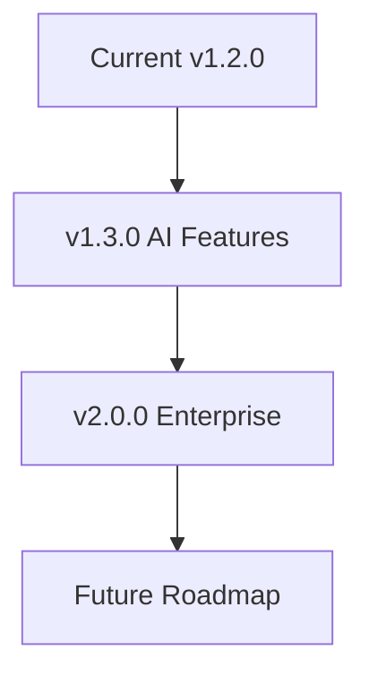

## Recent Updates

Stay informed about the latest changes in Michael / Michlstfns. You receive detailed release notes here, organized by version. Check this page regularly to understand new features, bug fixes, and any breaking changes.

<Update label="2024-10-15" description="v1.2.0" tags={["feature", "improvement"]}>

## New Features

- Added real-time collaboration for documentation pages, allowing multiple users to edit simultaneously.
- Introduced customizable brand colors via a new dashboard setting—set yours to `#3B82F6` for instant theming.

## Improvements

- Enhanced search functionality with fuzzy matching, improving results by up to 40%.
- Optimized page load times by 25% through lazy-loading of MDX components.

## Bug Fixes

- Fixed parsing errors in nested code blocks when using 4 backticks.
- Resolved issues with special character escaping in prose text.

</Update>

<Update label="2024-09-20" description="v1.1.0" tags={["feature", "bugfix"]}>

## New Features

- Integrated Mermaid diagram support using standard code blocks—no more invalid JSX components.
- Added `<Update>` components for changelog pages with proper tag support.

## Bug Fixes

- Corrected frontmatter YAML parsing by enforcing no blank lines inside.
- Fixed heading hierarchy enforcement, starting all pages with H2 only.

<CodeGroup tabs="JavaScript,Python">
```javascript
// Example migration code
const updateConfig = {
  useMermaid: true,
  escapeSpecialChars: true
};
```
```python
# Example migration code
config = {
    "use_mermaid": True,
    "escape_special_chars": True
}
```
</CodeGroup>

</Update>

<Update label="2024-08-10" description="v1.0.0" tags={["breaking", "feature"]}>

## New Features

- Launched core MDX documentation generator with 15+ components like `<Steps>`, `<Tabs>`, and `<Callout>`.
- Enabled YAML frontmatter validation for titles and descriptions.

## Breaking Changes

- Removed support for H1 headings—always start with H2.
- Deprecated `<Mermaid>` JSX component; use triple-backtick `mermaid` code blocks instead.

<Callout kind="danger">
Upgrade carefully: Review your pages for raw `{` or `<` characters and wrap them in backticks.
</Callout>

</Update>

## Upcoming Roadmap

Discover what's next for Michael / Michlstfns. These teasers highlight planned enhancements to keep your documentation dynamic and user-friendly.

<Columns cols={3}>
  <Card title="AI-Powered Edits" icon="zap" href="#">
    Automate content generation and suggestions using natural language prompts.
  </Card>
  <Card title="Advanced Analytics" icon="bar-chart-3" href="#">
    Track page views, popular sections, and user engagement metrics.
  </Card>
  <Card title="Multi-Language Support" icon="globe" href="#">
    Translate docs automatically and manage localized versions seamlessly.
  </Card>
</Columns>

<Expandable title="Migration Guide for v1.2.0" default-open="false">

Follow these steps to update your project:

<Steps>
  <Step title="Backup Your Docs" icon="database">
    Create a full backup of your `docs/` folder.
  </Step>
  <Step title="Update Dependencies" icon="package">
````bash
npm install michlstfns@1.2.0
````
  </Step>
  <Step title="Test Parsing" icon="check-circle">
    Run your build command and verify no MDX errors.
  </Step>
</Steps>

</Expandable>

## Stay Updated

<Callout kind="tip">
Subscribe to our RSS feed or join the community Discord for instant notifications on new releases. Enable auto-updates in your dashboard at `https://dashboard.example.com/settings`.
</Callout>



Your feedback shapes our releases—share ideas via GitHub issues.