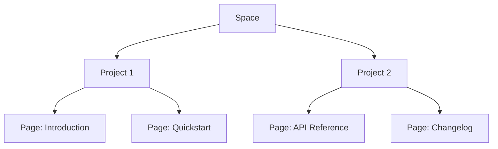

## Overview

Michael / Michlstfns organizes your documentation into flexible spaces that scale with your projects. You define spaces as top-level containers for related docs, enabling clear separation between products, teams, or initiatives. This structure supports hierarchical organization, where projects nest within spaces, and pages form the content layer.

Grasp these concepts to build efficient workflows. You manage content through paradigms like versioned pages and collaborative editing, ensuring scalability as your documentation grows.

<Callout kind="info">
  Review your space settings at `https://dashboard.example.com/spaces` to align with these principles.
</Callout>

## Documentation Space Structure

Spaces serve as the root of your documentation hierarchy. Each space contains projects, which group related pages.

<Columns cols={3}>
  <Card title="Spaces" icon="database" href="#spaces">
    Top-level containers for organizing docs across teams.
  </Card>
  <Card title="Projects" icon="folder" href="#projects">
    Group pages by feature or release within a space.
  </Card>
  <Card title="Pages" icon="file-text" href="#pages">
    Individual MDX documents with rich components.
  </Card>
</Columns>

This structure prevents sprawl. You assign permissions at the space level, cascading to projects and pages.



## Project Hierarchies and Relationships

Projects establish relationships through linking and inheritance. You link pages across projects for cross-references, and inherit frontmatter like brand colors (`#3B82F6` for Michael / Michlstfns).

<Expandable title="Advanced Inheritance Rules" default-open="false">
  Projects inherit space-level metadata. Override with project-specific YAML:

  ```yaml
  # project.yml
  title: My Project
  brandColor: "#3B82F6"
  parentSpace: default-space
  ```
</Expandable>

Use navigation configs to define hierarchies dynamically.

## Content Management Paradigms

Michael / Michlstfns supports multiple paradigms for content handling.

<Tabs>
  <Tab title="Versioned Pages" icon="git-branch">
    Track changes with semantic versioning. Publish previews before merging.

    <CodeGroup tabs="CLI,API">
    ````bash
    mdx version --bump minor docs/intro.mdx
    mdx publish --preview
    ````

    ````javascript
    await fetch('https://api.example.com/v1/pages/version', {
      method: 'POST',
      body: JSON.stringify({ path: 'docs/intro.mdx', bump: 'minor' })
    });
    ````
    </CodeGroup>
  </Tab>
  <Tab title="Collaborative Editing" icon="users">
    Real-time edits with conflict resolution. Assign reviewers per project.
  </Tab>
  <Tab title="Search-First Indexing" icon="search">
    Pages index automatically. Query via API for dynamic navigation.
  </Tab>
</Tabs>

## Scalability for Growing Projects

Scale your docs with these steps.

<Steps>
  <Step title="Assess Growth" icon="trending-up">
    Monitor page count and traffic at `https://dashboard.example.com/analytics`.
  </Step>
  <Step title="Modularize" icon="package">
    Split large projects into sub-projects. Link with `[Cross-project link](/other-space/project/page)`.
  </Step>
  <Step title="Automate" icon="zap">
    Use webhooks for CI/CD integration.

    ````yaml
    # .github/workflows/docs.yml
    name: Deploy Docs
    on: push
    jobs:
      deploy:
        runs-on: ubuntu-latest
        steps:
          - uses: actions/checkout@v4
          - run: mdx deploy --space default-space
    ````
  </Step>
  <Step title="Optimize" icon="settings">
    Enable caching and CDN via space settings.
  </Step>
</Steps>

<Callout kind="tip">
  Start small: Create one space per major product. Migrate incrementally as needs evolve.
</Callout>